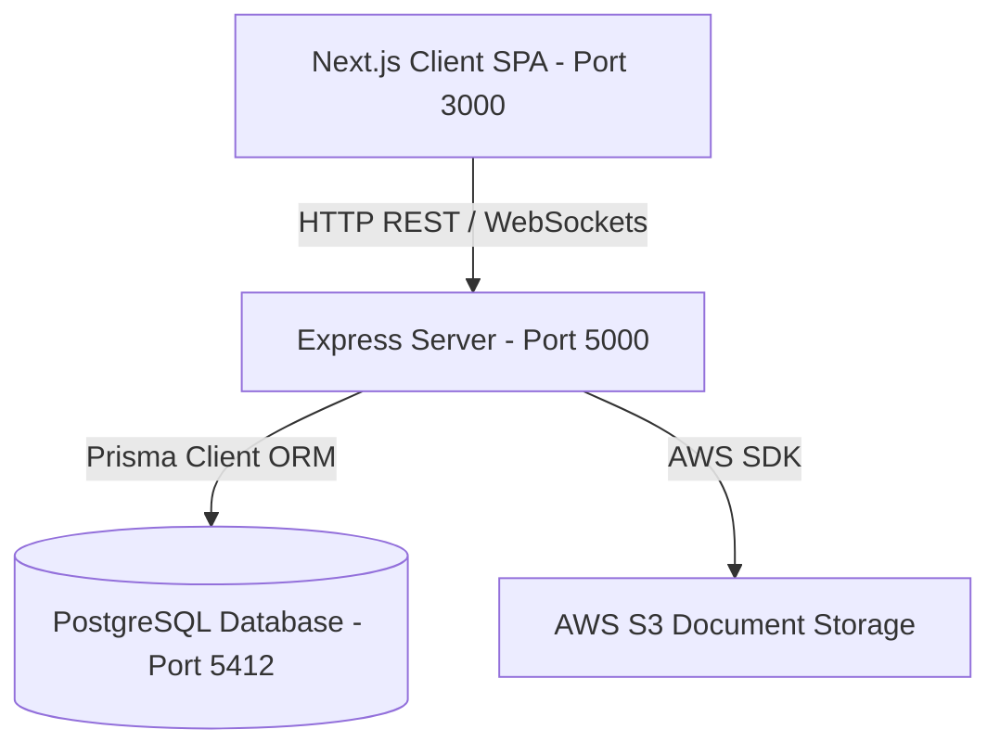
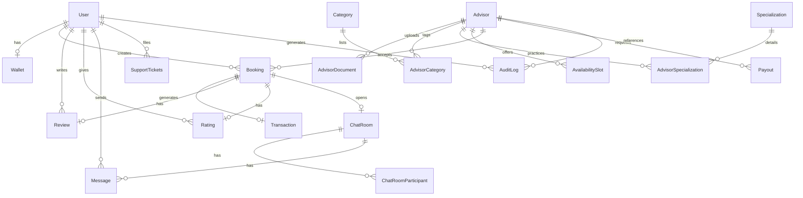
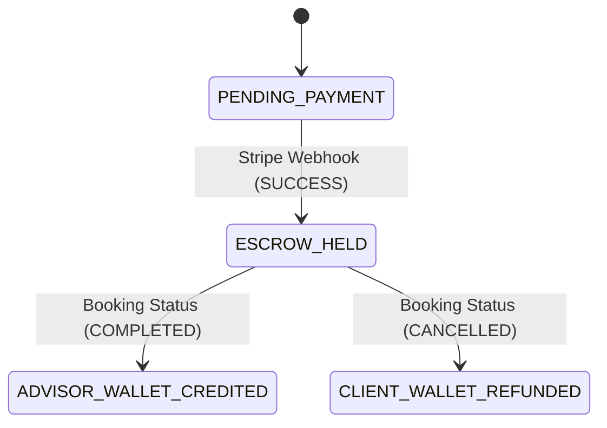
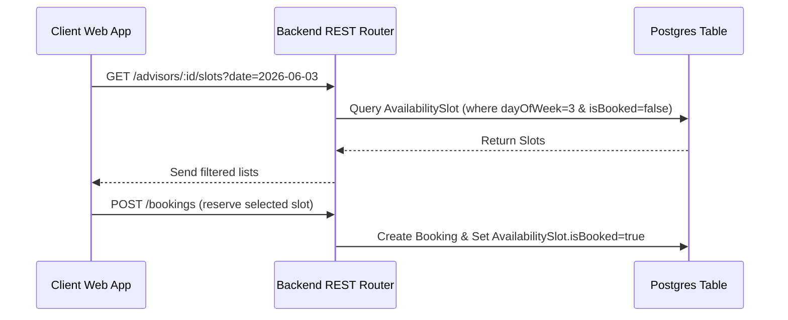

# BrokerSaab Architecture & Enhancement Blueprint

This document provides a comprehensive technical blueprint of the **BrokerSaab** advisory platform, mapping out the current Monorepo architecture, Prisma database schema, and REST API endpoints. It includes detailed step-by-step implementation templates for future feature enhancements.

---

## 🏛️ Monorepo Architecture Overview

BrokerSaab is built using a modern decoupled monorepo architecture:



* **Frontend (`apps/frontend`)**: Built on Next.js, structured with Tailwind CSS, React Query (Tanstack), Lucide icons, and bilingual (English/Hindi) state engines.
* **Backend (`apps/backend`)**: Built with Node.js, Express, TypeScript, and Prisma ORM. It runs a REST API layer secured via JWT auth.
* **Database (`PostgreSQL`)**: Governed by Prisma, containing schemas for bookings, user roles, rating metrics, transactional escrow ledgering, and real-time chat spaces.

---

## 🗃️ Database Schema Blueprint

The Postgres database structure contains 16 models representing the complete workflow of matching clients with legal & documentation advisors.



### Core Enumerations (`enum`)
1. **`Role`**: `SUPER_ADMIN`, `SUB_ADMIN`, `ADVISOR`, `CLIENT`
2. **`VerificationStatus`**: `PENDING`, `APPROVED`, `REJECTED`, `SUSPENDED`
3. **`ConsultationMode`**: `PHONE`, `VIDEO`, `CHAT`, `PHYSICAL`
4. **`BookingStatus`**: `PENDING`, `ACCEPTED`, `COMPLETED`, `CANCELLED`, `DISPUTED`
5. **`TransactionType`**: `CREDIT`, `DEBIT`
6. **`TransactionStatus`**: `PENDING`, `SUCCESS`, `FAILED`, `REFUNDED`

---

## 🔌 Express REST API Router Registry

The backend REST routes are structured under `/api/v1` and handle validation using Zod schemas.

| Route File | Base Path | Methods & Endpoints | Purpose / Details |
| :--- | :--- | :--- | :--- |
| **`auth.ts`** | `/api/v1/auth` | `POST /signup`<br>`POST /login` | Validates client/advisor input. Generates signed JWT session tokens. |
| **`advisors.ts`** | `/api/v1/advisors` | `GET /`<br>`GET /:id`<br>`POST /availability`<br>`POST /documents`<br>`POST /categories`<br>`POST /specializations` | Catalog searching. Multi-criteria advisor filtering. Uploads license, categories, and calendar availability. |
| **`bookings.ts`** | `/api/v1/bookings` | `POST /`<br>`GET /`<br>`GET /:id`<br>`PUT /:id/status` | Creates appointments. Implements status transitions (`ACCEPTED`, `COMPLETED`, `CANCELLED`). |
| **`payments.ts`** | `/api/v1/payments` | `POST /checkout-session`<br>`POST /webhook`<br>`GET /wallet` | Stripe session creation. Payment verification webhooks. Wallet balance queries. |
| **`admin.ts`** | `/api/v1/admin` | `GET /advisors/pending`<br>`PUT /advisors/:id/verify`<br>`GET /audit-logs` | Admin portal management. Document validation, verification updates, and security logs auditing. |

---

## 🚀 Further Enhancement Blueprints

Use the following architectural designs to build out upcoming features in the project.

### 💬 1. Real-Time Chat & Communications (WebSockets)
**Goal**: Enable real-time messaging between clients and advisors inside active bookings.

> [!NOTE]
> Prisma already defines the `ChatRoom`, `ChatRoomParticipant`, and `Message` models. Messages should be backed up in Postgres while piped in real-time.

#### Step 1: Install Socket.io dependency
```bash
npm install socket.io @types/socket.io --workspace=apps/backend
npm install socket.io-client --workspace=apps/frontend
```

#### Step 2: Initialize Socket Server in `apps/backend/src/app.ts`
Modify the server initialization to wrap the Express app in an HTTP Server and bind Socket.io:
```typescript
import http from 'http';
import { Server } from 'socket.io';
import prisma from './config/db';

const app = express();
const server = http.createServer(app);
const io = new Server(server, {
  cors: { origin: process.env.FRONTEND_URL || "http://localhost:3000" }
});

io.on('connection', (socket) => {
  console.log('Client connected:', socket.id);

  // Authenticate user & join designated Booking Room
  socket.on('join_room', async ({ bookingId, userId }) => {
    // Validate that user is a participant of the booking
    const participant = await prisma.chatRoomParticipant.findUnique({
      where: { chatRoomId_userId: { chatRoomId: bookingId, userId } }
    });
    if (participant) {
      socket.join(bookingId);
      console.log(`User ${userId} joined ChatRoom ${bookingId}`);
    }
  });

  // Handle incoming message event
  socket.on('send_message', async ({ bookingId, senderId, content }) => {
    // Save to Postgres DB via Prisma
    const message = await prisma.message.create({
      data: {
        chatRoomId: bookingId,
        senderId,
        content
      }
    });
    // Broadcast message to everyone else in the room
    io.to(bookingId).emit('receive_message', message);
  });

  socket.on('disconnect', () => {
    console.log('Client disconnected:', socket.id);
  });
});

// Listen on HTTP server wrapper instead of Express app
server.listen(PORT, () => ...);
```

---

### 💳 2. Platform Escrow & Wallet Balancing Ledger
**Goal**: Implement an escrow payment system. The client's funds are held by the platform upon booking creation and released to the advisor's wallet minus a platform commission when the booking state changes to `COMPLETED`.

#### Escalation State Machine


#### Step 1: Stripe Checkout Integration
Inside `apps/backend/src/routes/payments.ts`:
```typescript
router.post('/checkout-session', authenticateJWT, async (req: Request, res: Response) => {
  const { bookingId } = req.body;
  const booking = await prisma.booking.findUnique({
    where: { id: bookingId },
    include: { advisor: true }
  });

  if (!booking) return res.status(404).json({ message: 'Booking not found' });

  const session = await stripe.checkout.sessions.create({
    payment_method_types: ['card'],
    line_items: [{
      price_data: {
        currency: 'inr',
        product_data: { name: `Consultation with ${booking.advisor.fullName}` },
        unit_amount: Math.round(Number(booking.totalFee) * 100), // convert to paisa
      },
      quantity: 1,
    }],
    mode: 'payment',
    success_url: `${process.env.FRONTEND_URL}/bookings/${bookingId}?success=true`,
    cancel_url: `${process.env.FRONTEND_URL}/bookings/${bookingId}?cancel=true`,
    metadata: { bookingId, userId: req.user.id }
  });

  res.json({ url: session.url });
});
```

#### Step 2: Handle Ledger releases on Booking Completion
Inside `apps/backend/src/routes/bookings.ts`, modify the status transition route:
```typescript
router.put('/:id/status', authenticateJWT, async (req: Request, res: Response) => {
  const { id } = req.params;
  const { status } = req.body; // e.g. "COMPLETED" or "CANCELLED"
  
  const booking = await prisma.booking.findUnique({
    where: { id },
    include: { advisor: true, transaction: true }
  });
  
  if (!booking || !booking.transaction) return res.status(404).json({ message: 'Booking not found' });
  
  if (status === 'COMPLETED' && booking.status !== 'COMPLETED') {
    // Escrow Release Calculation
    const total = Number(booking.totalFee);
    const commissionRate = 0.20; // 20% platform cut
    const commission = total * commissionRate;
    const netAmount = total - commission;
    
    await prisma.$transaction([
      // 1. Update Booking status to COMPLETED
      prisma.booking.update({
        where: { id },
        data: { status: 'COMPLETED' }
      }),
      // 2. Update Transaction record
      prisma.transaction.update({
        where: { id: booking.transaction.id },
        data: {
          status: 'SUCCESS',
          commission,
          netAmount
        }
      }),
      // 3. Credit Advisor's Ledger balance via Wallet increment
      prisma.wallet.upsert({
        where: { userId: booking.advisorId },
        update: { balance: { increment: netAmount } },
        create: { userId: booking.advisorId, balance: netAmount }
      })
    ]);
  }
  
  res.json({ success: true });
});
```

---

### 📅 3. Calendar Availability & Reservation Booking Scheduler
**Goal**: Create an interactive client UI scheduler that queries availability slots and locks them upon booking creation.



#### Step 1: Create frontend Booking Scheduler modal
Inside `apps/frontend/src/components/BookingModal.tsx`, implement a grid that queries matching daily slots:
```typescript
import { useQuery, useMutation } from '@tanstack/react-query';

export default function BookingModal({ advisorId }: { advisorId: string }) {
  const [selectedDate, setSelectedDate] = useState(new Date());
  
  const { data: slots } = useQuery({
    queryKey: ['advisor-slots', advisorId, selectedDate],
    queryFn: () => fetch(`/api/v1/advisors/${advisorId}/slots?day=${selectedDate.getDay()}`).then(res => res.json())
  });

  const bookingMutation = useMutation({
    mutationFn: (slotId: string) => fetch('/api/v1/bookings', {
      method: 'POST',
      headers: { 'Content-Type': 'application/json' },
      body: JSON.stringify({ advisorId, slotId, date: selectedDate })
    })
  });

  return (
    <div className="p-6 bg-white rounded-2xl shadow-xl">
      <h3 className="text-lg font-bold text-slate-800 mb-4">Book a consultation</h3>
      {/* Date Picker */}
      <input type="date" value={selectedDate.toISOString().split('T')[0]} onChange={e => setSelectedDate(new Date(e.target.value))} className="mb-4 p-2 border rounded-xl w-full"/>
      
      {/* Dynamic Slots */}
      <div className="grid grid-cols-3 gap-2">
        {slots?.map((slot: any) => (
          <button key={slot.id} onClick={() => bookingMutation.mutate(slot.id)} className="p-2 border rounded-xl hover:bg-gold-500 hover:text-navy-950 font-semibold text-xs">
            {slot.startTime} - {slot.endTime}
          </button>
        ))}
      </div>
    </div>
  );
}
```

---

## 🛠️ Validation, Verification & Auditing
Before pushing code changes to production, ensure these items are verified:
1. **Zod Validation Integration**: Ensure all inputs (both body parameters and query inputs) conform to defined Zod validation schemas prior to processing.
2. **Pre-commit Typechecking**: Run TypeScript build validations in the root repository path:
   ```bash
   Set-ExecutionPolicy -Scope Process -ExecutionPolicy Bypass; npm run build --workspace=apps/frontend
   ```
3. **Database Migration Sync**: Whenever editing `schema.prisma`, execute the following synchronization commands to keep production and local schemas aligned:
   ```bash
   npx prisma migrate dev --name name_of_change --schema=apps/backend/prisma/schema.prisma
   ```
